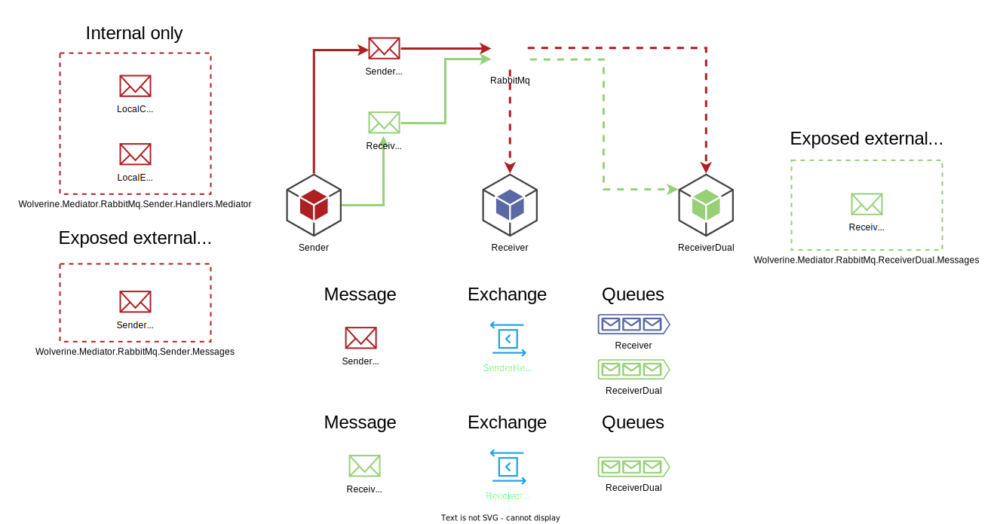

# wolverine-mediator-rabbitmq

### State right now:

It' sending and gets received on the right queue, and get fetched by the right service/services.
Local messages also work.

```Wolverine.Mediator.RabbitMq.Sender``` can send it's own event
- ```Wolverine.Mediator.RabbitMq.Receiver``` fetches it in the right handler
- ```Wolverine.Mediator.RabbitMq.ReceiverDual``` fetches it in the right handler

```Wolverine.Mediator.RabbitMq.Sender``` can send the command from ```Wolverine.Mediator.RabbitMq.ReceiverDual```
- ```Wolverine.Mediator.RabbitMq.ReceiverDual``` fetches it in the right handler

I've hidden som setup in extensions, like what exchange to send messages to, and bind queues to those exchanges.

This is a desired state when it comes to functionality. There is probably a lot to fix when it comes to settings.



